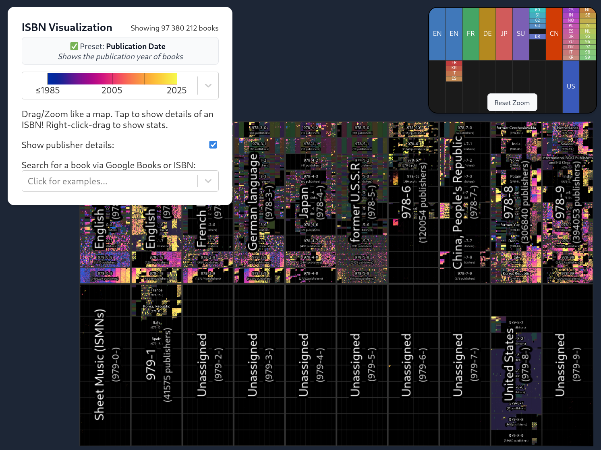
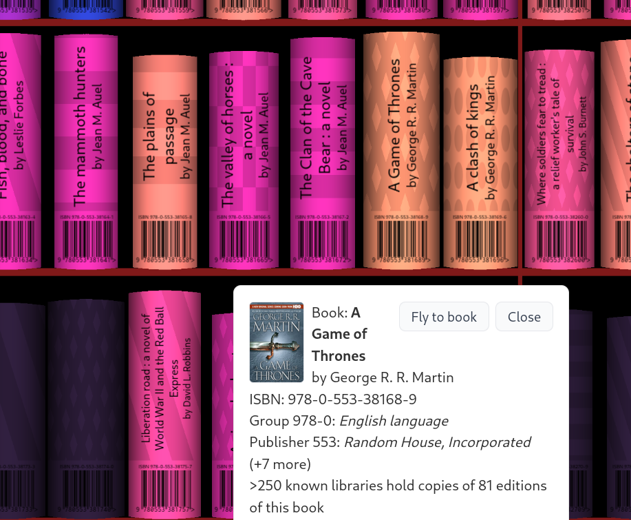

# ISBN Visualization

**Please read https://phiresky.github.io/blog/2025/visualizing-all-books-in-isbn-space/ for the live version and description of this project**

Screenshots:




## Setup

Fetch the main repo and (if you want) the precomputed data.

```bash
# code
git clone git@github.com:phiresky/isbn-visualization.git
# precomputed prefix data
git clone git@github.com:phiresky/isbn-visualization-json.git
# precomputed png datasets
git clone git@github.com:phiresky/isbn-visualization-images.git
cd isbn-visualization
mkdir public
ln -s $PWD/../isbn-visualization-images public/images
ln -s $PWD/../isbn-visualization-json/prefix-data public/prefix-data
```

Then install the JS dependencies. You'll need [pnpm](https://pnpm.io/). The easiest way is corepack, which is bundled with nodejs:

```bash
corepack enable
pnpm install
# run in dev mode (WARNING: perf in dev mode is worse than prod mode!)
pnpm run dev
# build in prod mode
pnpm run build
# serve from any static http server (example)
cd dist && python3 -m http.server
```

## Preprocessing scripts

This repo contains a few scripts to generate the relevant data for the web viewer.

### Running in docker

You can build a docker container containing all relevant code using

```bash
docker build -t phiresky/isbn-visualization .
```

### `scripts/process-all.sh`

A convenience script to run the JS build and all processing steps that have not been run yet:

Inputs:

- PUBLIC_BASE_PATH: the url prefix you will host the project under (e.g. /isbn-visualization)
- DATA_DIR: the directory the input data files are in and intermediary products will be stored
- OUTPUT_DIR_PUBLIC: the output dir that you will host on your webhost (under PUBLIC_BASE_PATH)

Run in docker:

```bash
docker run --rm -it \
    -e PUBLIC_BASE_PATH=/isbn-visualization \
    -e DATA_DIR=/data \
    -e OUTPUT_DIR_PUBLIC=/public phiresky/isbn-visualization \
    -v ./data:/data \
    -v ./public:/public \
    phiresky/isbn-visualization
```

Directly:

```
PUBLIC_BASE_PATH=/ OUTPUT_DIR_PUBLIC=./public DATA_DIR=./data ./scripts/process-all.sh
```

### `scripts/gen-prefixes.ts`

This script generates the json files representing the groups/publisher ranges.

- Input: `isbngrp_records.jsonl.seekable.zst`
- Output: `public/prefix-data/*.json` (split by size), `data/prefix-data.json` (the full data)

```bash
pnpm tsx scripts/gen-prefixes.ts .../aa_meta__aacid__isbngrp_records__20240920T194930Z--20240920T194930Z.jsonl.seekable.zst
# compress them with zopfli (if you don't want to install zopfli, use `gzip -9 public/prefix-data/*.json`)
scripts/minify-prefix-data.sh
```

### `scripts/rarity`

This one written in Rust for performance. You'll need the [Rust compiler](https://www.rust-lang.org/).

- Input: aa_meta**aacid**worldcat\_\_20241230T203056Z--20241230T203056Z.jsonl.seekable.zst
- Output: `data/library_holding_data.sqlite3`

```bash
cd scripts/rarity
export RUSTFLAGS="-C target-cpu=native"
cargo run --release -- ~/Downloads/annas_archive_meta__aacid__worldcat__20241230T203056Z--20241230T203056Z.jsonl.seekable.zst
```

It takes 20min-1h to process the 250GByte source file.

### `scripts/write-images`

This script generates the png datasets.

Use `pnpm tsx scripts/write-images list` to list datasets:

```
Special datasets: [ 'publishers', 'all', 'rarity' ]
Normal datasets: [...depends on
]
```

The syntax is `pnpm tsx scripts/write-images [dataset] [zoom-level|all]`

Use all to generate all zoom levels from 1-4.

Input:

- for the `all` and normal datasets: `data/aa_isbn13_codes_20241204T185335Z.benc.zst` (or set env var `INPUT_BENC=path`)
- for the `publisher` dataset: `data/prefix-data.json` (generated by `scripts/gen-prefixes.ts`, or set env var `INPUT_PREFIX_DATA=path`)
- for the `rarity` dataset: `data/library_holding_data.sqlite3` (generated by `scripts/rarity` or set env var `INPUT_HOLDING_SQLITE=path`)

Output:

- `public/images/tiled/[dataset]/zoom-{1,2,3,4}/*.png`
- `public/images/tiled/[dataset]/written.json` with the list of images (only if zoom level=all)
- `public/images/tiled/[dataset]/stats.json`

```bash
# you might want to run some these in parallel, each takes a 1-10 minutes.

for dataset in all publishers rarity publication_date cadal_ssno cerlalc duxiu_ssid edsebk gbooks goodreads ia isbndb isbngrp libby md5 nexusstc nexusstc_download oclc ol rgb trantor; do
    pnpm tsx scripts/write-images $dataset all
done
```

Special datasets:

#### Dataset `all`

Aggregates all datasets, sets white pixels for every book in any of the datasets, black pixels otherwise.
Zoomed out views contain the average, so a pixel with 50% existing books will be brightness 50%.

#### Dataset `publication_date`

The red in each pixel is the average publication year (minus 1800, clamped to 0-255). The green pixel is the same. The blue pixel is the ratio of books present in the dataset (255 = 100%).

#### Dataset `publishers`

Publishers are assigned an incrementing integer ID by unique `registrant_name`. This integer is stored in the PNG RGB: `publisherId = red * 65536 + green * 256 + blue`.

Zoomed out views contain non-aggregated data (publisher ranges smaller than a pixel will not appear).

#### Dataset `rarity`

The variables holdingCount, editionCount, bookCount are set in the r,g,b colors respectively.

Zoomed out views contain the sum of each of the values. If one of the values is ≥ 255, all values are scaled down accordingly. For example:

`r=4,g=2,b=1` means that there is exactly one book in this pixel with 4 holdings and 2 editions
`r=10,g=3,b=3` means there's three books with a total of 10 holdings and 3 editions
`r=10,g=3,b=255` means thre's more than 254 books, with on average `10/255` holdings per book, and `3/255` editions per book.
`r=255,g=10,b=30` means there's more than 254 holdings, with on average `255/10` holdings per edition and `255/30` books per edition

#### Other datasets

The other datasets contain the data directly from the benc file (white=exists, black=does not exist)

### `scripts/merge-stats.ts`

Merges the statistics from the different datasets into a single file.

- Input: `public/images/tiled/*/stats.json`
- Output: `public/prefix-data/stats.json`

```bash
pnpm tsx scripts/merge-stats.ts
```

### `scripts/minify-images.sh` (optional)

Minify the images using [oxipng](https://github.com/shssoichiro/oxipng) and [pngquant](https://pngquant.org/) (for lossy datasets).

This reduces image size by 5-50%!

```bash
scripts/minify-images.sh public/images/tiled/
# or
scripts/minify-images.sh public/images/tiled/[dataset]
```

## Running the main web viewer

URLs and paths are configured in `src/config.ts`. The default "advanced config", stored in the URL, is configured in `src/lib/RuntimeConfiguration.ts`.

Development: `pnpm run dev`

Runs the app in the development mode.<br>
Open [http://localhost:5173](http://localhost:5173) to view it in the browser.

The page will reload if you make edits.<br>

You can use the following debug objects exposed in the dev console:

- `store`: the main state store which can be manipulated, e.g. `store.showGrid = false`
- `threejsRoot`: the main threejs objects, e.g. `console.log(threejsRoot.camera.zoom)`
- `isbnlib`: the `isbn3` library for parsing ISBNs

### `pnpm run build`

Builds the app for production to the `dist` folder.<br>
It bundles the project in production mode and optimizes the build for the best performance.
If the app should not be hosted in the root path of a domain, set the env var e.g. `PUBLIC_BASE_PATH=/isbn-visualization`.

### Deployment

You can deploy the `dist` folder to any static host provider (netlify, surge, now, etc.)
